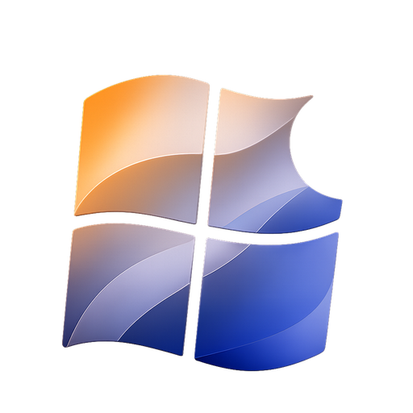

# Aurora Silicon {.home-page-title}

  
  
Windows on ARM for Apple Silicon

Aurora Silicon is working to bring Windows to Apple Silicon Macs. That means
understanding Apple's hardware, building the pieces Windows needs to boot, and
writing the drivers needed to make the platform useful.

!!! info "This site is still under construction"

    These pages are a work in progress. Plenty of them are incomplete, nothing
    here is definitive, and some of it will already be out of date.

    In the meantime the best path forward is our
    [Discord server](https://discord.gg/DXmsSSc5aY) — join and ask directly, and
    you will get a current answer rather than whatever this site last said.

## Where to start

### [Using Aurora Silicon](users/getting-started.md)

Start with the user guide, then check [feature support](feature-support/overview.md)
for your hardware.

### [Developing Aurora Silicon](developers/getting-started.md)

Set up the development tools, contribute code, or explore the
[research notes](research/overview.md).

The project is still experimental, but you're welcome to follow along, try it on
supported hardware, or get involved.
